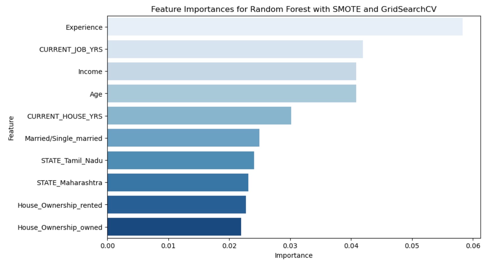

# Loan-Approval-Risk-Analysis-
# Introduction 
In India, access to credit is a powerful enabler of economic growth and personal advancement. However, the diverse socio-economic landscape presents unique challenges in assessing loan approval risks. With its vast population spanning urban and rural areas, India embodies a rich tapestry of economic activity and financial behaviors, making loan risk prediction both complex and crucial. India's financial landscape is marked by significant diversity. From bustling metropolitan cities with well-established financial infrastructures to remote villages where formal banking is still gaining ground, the range of loan applicants is wide. This diversity necessitates a robust and nuanced approach to risk assessment, which can be achieved through advanced machine learning techniques.
# Project Overview 
This analysis, conducted for Travis Loan Consultant, aims to predict loan approval risk using a comprehensive dataset of loan applicants from various states across India. The dataset provides detailed insights into the characteristics of loan applicants, capturing both numerical and categorical features such as demographic details, financial status, employment history, and ownership status. In this notebook, we employ a variety of machine learning models, including Logistic Regression, Random Forest, and Gradient Boosting (XGBoost). To address the inherent class imbalance in our dataset, we experiment with different data balancing strategies such as SMOTE (Synthetic Minority Over-sampling Technique) and Random Oversampling/Undersampling. Additionally, we utilize GridSearchCV for hyperparameter tuning to optimize the performance of our models.
# Business Problem 
Travis Loan Consultant aims to enhance its loan approval process by identifying the key factors that influence loan risk. The goal is to develop robust predictive models that accurately assess the risk associated with loan applicants. By understanding these factors, Travis Loan Consultant seeks to:

1. **Improve Risk Assessment**: Develop models that can accurately predict high-risk and low-risk loan applicants, minimizing the chances of approving high-risk loans while ensuring that low-risk applicants are not wrongly classified.
2. **Optimize Model Performance**: Utilize advanced machine learning techniques and hyperparameter tuning to maximize the precision and recall of the predictive models, ensuring reliable and actionable insights for loan approval decisions.
3. **Identify Key Risk Factors**: Analyze demographic, financial, employment, and ownership characteristics to pinpoint the most significant factors influencing loan risk, enabling more informed and strategic decision-making.
4. **Regional Insights**: Examine patterns and trends across different states in India to understand regional variations in loan risk, allowing for tailored risk management strategies.
# Data 
The data used in this analysis is sourced from a comprehensive loan approval dataset obtained from Kaggle. The dataset contains 252,000 entries of loan applicants from various states in India, providing detailed information on both numerical and categorical features. Key characteristics of the data include:

- **Demographic Details**: Age, gender, marital status, and location of applicants.
- **Financial Status**: Income levels, credit history, and existing debt.
- **Employment History**: Current job years, profession, and experience.
- **Ownership Status**: House ownership (owned or rented) and car ownership.

Above is a feature importance plot that highlights the most significant factors influencing loan approval risk. This visualization helps us understand which features have the greatest impact on the model's predictions, guiding further refinement and interpretation of the model.

This plot reveals that factors such as income, age, and experience play crucial roles in determining loan approval risk, emphasizing the need to consider these variables in the loan assessment process.
# Modeling 
In the modeling phase of this analysis, we employed a variety of machine learning techniques to predict loan approval risk. The primary models used include Logistic Regression, Random Forest, and Gradient Boosting (XGBoost). To enhance the performance of these models, we addressed the inherent class imbalance in our dataset through different data balancing strategies such as SMOTE (Synthetic Minority Over-sampling Technique), Random Oversampling, and Random Undersampling.

We utilized GridSearchCV for hyperparameter tuning to optimize the performance of our models, ensuring the best possible precision and recall scores. Our goal was to develop robust predictive models that can accurately assess the risk associated with loan applicants, thereby aiding Travis Loan Consultant in making informed and effective loan approval decisions. The "Undersampled + SMOTE" Random Forest model emerged as the most effective, providing a balanced approach with high recall and acceptable precision, making it the preferred choice for predicting high-risk loan applicants.
# Conclusion
In this comprehensive loan risk analysis conducted for Travis Loan Consultant, we aimed to predict loan approval risk using a detailed dataset of loan applicants from various states in India. By employing a variety of machine learning techniques, including Logistic Regression, Random Forest, and Gradient Boosting (XGBoost), and experimenting with different data balancing strategies such as SMOTE, Random Oversampling, and Random Undersampling, we developed predictive models to accurately assess loan risk.

Among the evaluated models, the "Undersampled + SMOTE" Random Forest model demonstrated the best performance, achieving a balanced precision and recall, making it the most suitable for accurately predicting loan risk. This model effectively reduces the chances of missing high-risk applicants while minimizing false positives.
# Recommendations
Adopt the "Undersampled + SMOTE" Random Forest Model: Implement this model in your loan approval process to improve the identification of high-risk applicants while minimizing false positives.
Continuous Model Monitoring: Regularly monitor and update the model to ensure its performance remains optimal over time, considering changes in applicant profiles and market conditions.
- **Expand Data Collection**: Enhance the dataset with additional features and more recent data to further refine the model's predictive accuracy and robustness.
- **Enhanced Applicant Screening**: Use the model's insights to improve the initial screening process, ensuring that high-risk applicants undergo additional scrutiny before approval.
- **Targeted Marketing Campaigns**: Develop marketing strategies aimed at attracting low-risk applicants by highlighting favorable loan terms and conditions.
- **Ongoing Model Updates**: Regularly update the predictive model with new data to ensure its accuracy and relevance in identifying loan risk over time.
By following these recommendations and leveraging the insights gained from this analysis, Travis Loan Consultant can significantly improve its loan risk management, ultimately leading to better decision-making and reduced financial risk.

